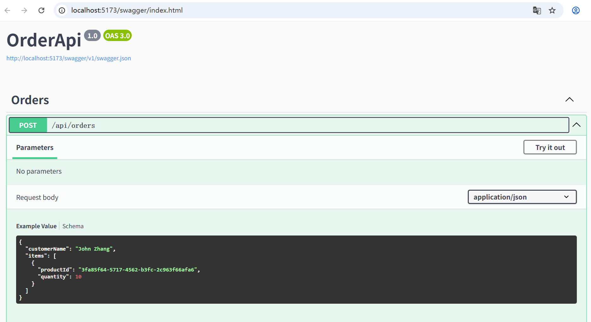

# Order Api
This is Orders API using C#, .NET Web API and SQLite

### Run on local
Open solution using Vistual Studio 2022, Click Run in toolbar

It will open [http://localhost:5173/swagger/index.html](http://localhost:5173/swagger/index.html) in the browser.

## Code Structure

### OrderApi
Data: Data Models, DTOs and Repositories

Services: Services, like OrderService

Controller: Controllers, like OrderController

### OrdersApi.Tests
unit tests

## Screenshot
